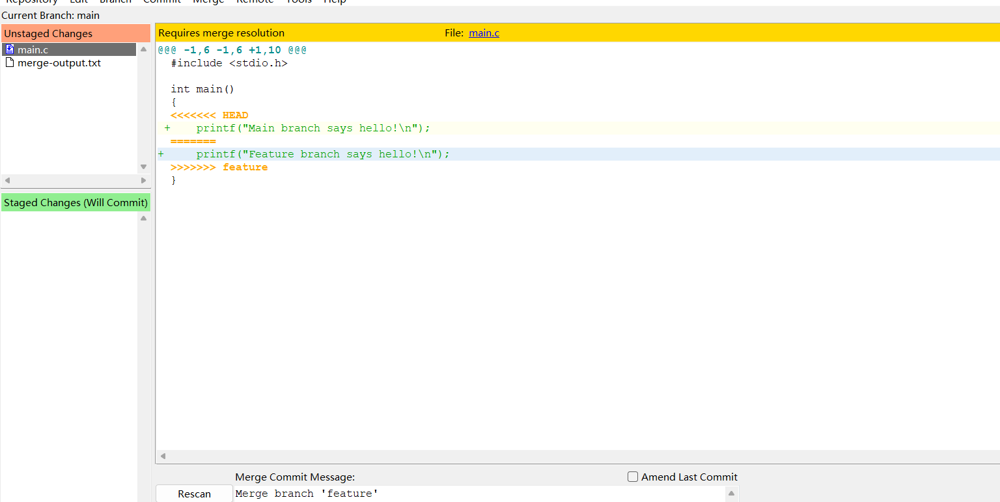
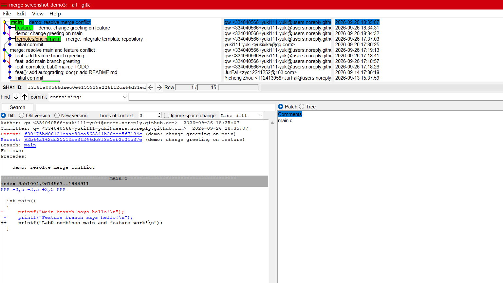

# Lab0：GitLab 实验报告

## 文档问题

### 问题一：你是否有多人协同开发经历？

我以前没有参加过多人协同开发。本次实验中，我分别在 `main` 和 `feature` 两个分支上修改同一个文件，再把两个分支合并到一起，因此第一次完整地体验了并行修改、产生冲突以及解决冲突的过程。

### 问题二：为什么 Git 要分为暂存和提交两个步骤？

Git 把暂存和提交分成两个步骤，是因为工作区里的修改不一定都属于同一个任务。先把准备提交的内容放入暂存区，可以在提交之前检查文件范围和具体差异，确认这次提交只包含一个清楚的改动；之后再执行提交，Git 才会把暂存区中的内容保存成一个带有说明和时间位置的版本。这样处理以后，即使还有没有完成的修改留在工作区，也不会被一起写进当前提交，后面查看历史时也更容易理解每次变更到底解决了什么问题。

### 问题三：`git branch` 和 `git branch -a` 有什么区别？

直接执行 `git branch` 时，Git 只会显示本地分支；加上 `-a` 以后，除了本地分支之外，还会显示本机已经记录下来的远程跟踪分支。远程跟踪分支反映的是最近一次获取远程仓库时的状态，因此它不等于当前网络上的实时结果，使用前仍然需要根据实际情况执行 `git fetch`。命令输出中带有 `*` 的分支就是当前所在的分支。

### 问题四：阅读两篇文章并说明为什么要学习 Git

我阅读了提交信息编写指南和语义化版本规范。前一篇文章让我意识到，提交说明不能只写成“修改文件”这样含义模糊的话，而应该直接说明这次提交完成了什么工作，必要时再补充修改原因；后一篇文章把版本号拆成主版本号、次版本号和修订号，并用兼容性变化来区分三者，这种约定能让使用者在升级软件前大致判断更新的影响。对我来说，学习 Git 的直接原因是以后写程序时需要保留修改过程，出现问题时能够回到之前的状态，也能够用分支把不同尝试隔离开来。多人一起开发时，清楚的提交记录和明确的合并过程还可以帮助大家判断修改来自哪里，从而更快地处理冲突。

## 实验过程与结果

实验从课程提供的模板仓库开始。我先克隆了 `https://github.com/ICS-26Fall-FDU/GitLab`，然后在 `main.c` 中完成 TODO，把输出语句改成 `printf("Hello from Lab0!\\n");`，并提交了 `dbc85d9`，提交说明为 `feat: complete Lab0 main.c TODO`。接着，我从这个状态创建 `feature` 分支，把同一行改成 `Feature branch says hello!` 后提交了 `d021093`；回到 `main` 分支后，我又把这一行改成 `Main branch says hello!`，提交了 `942e104`。因为两个分支修改的是同一行，合并时产生了预期的内容冲突。

在 `main` 分支执行 `git merge feature` 后，终端实际输出如下：

```text
Auto-merging main.c
CONFLICT (content): Merge conflict in main.c
Automatic merge failed; fix the file and then commit the result.
```



我打开 `main.c` 检查冲突标记，最后把两条分支的修改意图合并成一句新的输出语句：

```c
printf("Lab0 combines main and feature work!\\n");
```

冲突解决后，我提交了 `9a0b552`，提交说明为 `merge: resolve main and feature conflict`。这次合并的提交关系如下，能够看出 `feature` 和 `main` 分别从同一个基础提交继续修改，随后在合并提交处汇合：

```text
*   9a0b552 merge: resolve main and feature conflict
|\\
| * d021093 feat: add feature branch greeting
* | 942e104 feat: add main branch greeting
|/
* dbc85d9 feat: complete Lab0 main.c TODO
```



上面的两张图分别对应冲突出现时的文件状态，以及解决冲突并完成合并提交后的结果。

## 实验体会

这次实验让我比较直观地看到，分支并不是把文件简单复制一份，而是让不同修改沿着各自的提交历史继续发展；当两个分支碰巧改到同一处内容时，Git 会暂停合并，把决定权交给开发者。解决冲突时不能只追求让命令继续执行，还要重新阅读上下文，判断两边的修改是否都需要保留，再把最终结果提交下来。以后提交前，我会先查看 `git status` 和 `git diff --staged`，确认暂存区里的内容与提交说明相互对应，合并前也会先确认目标分支，避免把尚未整理好的修改带入历史。
